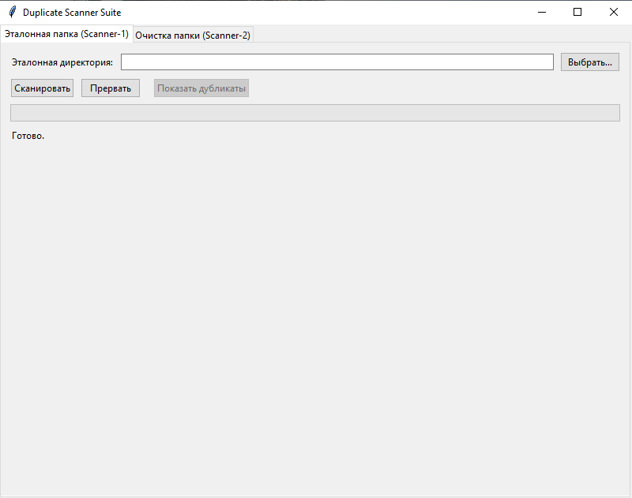

# Утилитка для удаления дубликатов файлов
# Duplicate Scanner Suite

##  Описание
Duplicate Scanner Suite — это инструмент для поиска и удаления дубликатов файлов.  
Он состоит из двух сканеров с графическим интерфейсом (GUI), объединённых в одно приложение:

- **Scanner‑1**: сканирует эталонную директорию, строит кэш (размеры и хэши файлов), показывает внутренние дубликаты.  
- **Scanner‑2**: сравнивает очищаемую директорию с эталонной, используя кэш Scanner‑1. Может удалять дубликаты, переносить уникальные файлы или просто собирать списки для анализа.

Главное окно (`main_gui.py`) объединяет оба сканера во вкладках.

---

##  Возможности
- Сканирование эталонной папки и построение кэша (`scanner1_cache.json`).
  - поиск дубликатов в этой папке
- Сравнение другой папки с эталонной:
  - фильтрация по размеру (экономия ресурсов);
  - проверка хэшей только при совпадении размера;
  - удаление дубликатов (по выбору);
  - перенос уникальных файлов в отдельную папку (по выбору);
  - режим «только анализ» без изменений файлов.
- Прогресс‑бар сканирования.
- Просмотр результатов (списки дубликатов и уникальных файлов).
- Удаление пустых папок отдельной кнопкой.
- Единый GUI с вкладками для обоих сканеров.
### Что можно добавить
- удаление дубликатов в эталонной папке (пока есть только поиск и просмотр)
---

##  Структура проекта

```
project_root/
├─ main_gui.py                # общий GUI, точка входа
├─ README.md                   # описание проекта
└─ src/
    ├─ init.py
    |─ removing_duplicates/
    ├─ init.py
    ├─ scanner1.py
    ├─ gui_for_scanner_1.py
    ├─ scanner2.py
    ├─ gui_for_scanner_2.py
    └─ utils.py
```

---

##  Запуск
1. Установите Python 3.13+.
2. Клонируйте репозиторий.
3. Запустите приложение:


   ```bash
   python main_gui.py```

4. В открывшемся окне выберите вкладку:
    - Эталонная папка (Scanner‑1) — для построения кэша.
    - Очистка папки (Scanner‑2) — для сравнения и очистки другой директории.

---

## Скриншоты 
### Главное окно  
### Вкладка Scanner‑1  
### Вкладка Scanner‑2 

---


##  Зависимости
    - tkinter (обычно входит в стандартную библиотеку Python).
    - Дополнительно: hashlib, json, shutil, pathlib — стандартные модули Python.

## Примечания
    - Кэш Scanner‑1 (scanner1_cache.json) должен находиться в эталонной директории.
    - Scanner‑2 использует этот кэш для сравнения.
    - Удаление пустых папок выполняется только по явной команде из GUI.
    - Прогресс‑бар обновляется после обработки каждого файла (для больших директорий можно оптимизировать частоту обновления).
## Цель проекта
    - Обеспечить удобный и безопасный способ управления дубликатами файлов через единый графический интерфейс.

---

## Лицензия
MIT License
