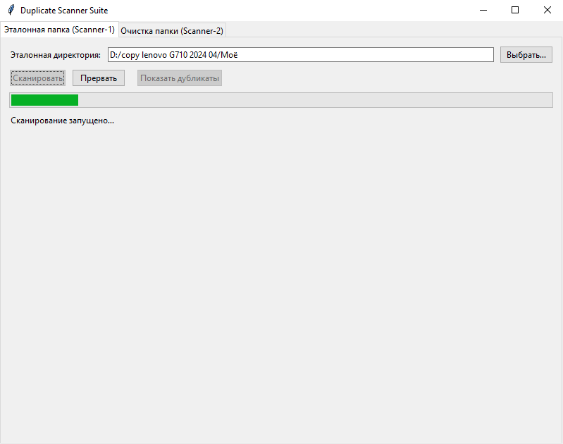
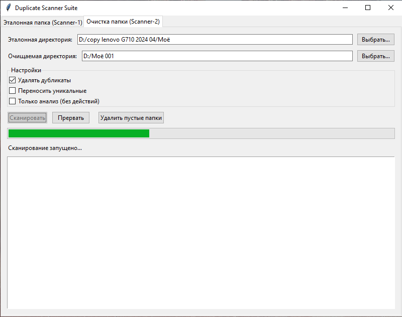

# Утилитка для удаления дубликатов файлов
# PET Duplicate Scanner Suite

## Описание
Pet Duplicate Scanner Suite — это домашняя утилита для поиска и безопасного удаления дубликатов файлов. Два режима работы: анализ эталонной папки и очистка целевой папки от копий из эталона. 

## Особенности

- **Двухэтапная фильтрация**: сначала по размеру файла, затем по SHA-256 хешу - быстро и надёжно
- **Кэширование хешей** эталонной директории - повторные сканирования в разы быстрее
- **Два независимых сканера**:
  - *Scanner 1*: анализ эталонной папки, поиск внутренних дубликатов, формирование кэша
  - *Scanner 2*: сравнение целевой папки с эталоном, удаление дубликатов или перенос уникальных файлов
- **Tkinter GUI** с вкладками, прогресс-баром, возможностью прервать сканирование

Главное окно (`main_gui.py`) объединяет оба сканера во вкладках.

---

##  Возможности
- Сканирование эталонной папки и построение кэша (`scanner1_cache.json`).
  - поиск дубликатов в этой папке
- Сравнение другой папки с эталонной:
  - фильтрация по размеру (экономия ресурсов);
  - проверка хэшей только при совпадении размера;
  - удаление дубликатов (по выбору);
  - перенос уникальных файлов в отдельную папку (по выбору);
  - режим «только анализ» без изменений файлов.
- Прогресс‑бар сканирования.
- Просмотр результатов (списки дубликатов и уникальных файлов).
- Удаление пустых папок отдельной кнопкой.
- Единый GUI с вкладками для обоих сканеров.
### Что можно добавить
- удаление дубликатов в эталонной папке (пока есть только поиск и просмотр)
- удаление/перемещение файлов только после явного подтверждения .
---

##  Структура проекта

```
project_root/
├─ main_gui.py                # общий GUI, точка входа
├─ README.md                  # описание проекта
├─ pyproject.toml             
├─ images/
│   ├─ scanner1.png
│   ├─ scanner2.png
│   └─ main_window.png
└─ src/
    |─ removing_duplicates/
            ├─ __init__.py
            ├─ scanner1.py
            ├─ gui_for_scanner_1.py
            ├─ scanner2.py
            ├─ gui_for_scanner_2.py
            └─ utils.py
```

##  Запуск
1. Установите Python 3.13+ (должна работать на 3.8+).
2. Клонируйте репозиторий.
3. Запустите приложение:

 
```bash
python main_gui.py
```

### Рекомендуемый рабочий процесс

1. Запустите **Scanner‑1** для эталонной папки (например, основная коллекция фото)
2. Запустите **Scanner‑2** для целевой папки (например, загрузки из телефона):
   - Включите «Только анализ», чтобы сначала увидеть, что будет удалено
   - После проверки отчёта повторите сканирование с включёнными действиями

## Важно

⚠️ **Утилита предназначена для опытных пользователей.**  
Перед первым использованием на реальных данных:
- Протестируйте на копии данных
- Всегда используйте режим «Только анализ» для предварительной проверки
- Резервное копирование критичных файлов обязательно

Файлы удаляются безвозвратно (`os.unlink`). Перемещённые уникальные файлы сохраняются в подпапку `uniques` внутри эталонной директории.


---

## Скриншоты 
### Главное окно  
### Вкладка Scanner‑1  
### Вкладка Scanner‑2 

---  
  
  
##  Зависимости   

- tkinter (обычно входит в стандартную библиотеку Python).
- Дополнительно: hashlib, json, shutil, pathlib — стандартные модули Python.

##  Примечания   


- Кэш Scanner‑1 (scanner1_cache.json) должен находиться в эталонной директории.
- Scanner‑2 использует этот кэш для сравнения.
- Удаление пустых папок выполняется только по явной команде из GUI.
- Прогресс‑бар обновляется после обработки каждого файла (для больших директорий можно оптимизировать частоту обновления).

      
## Цель проекта  
- Обеспечить удобный и безопасный способ управления дубликатами файлов через единый графический интерфейс.
  
---

## Лицензия  

MIT License
